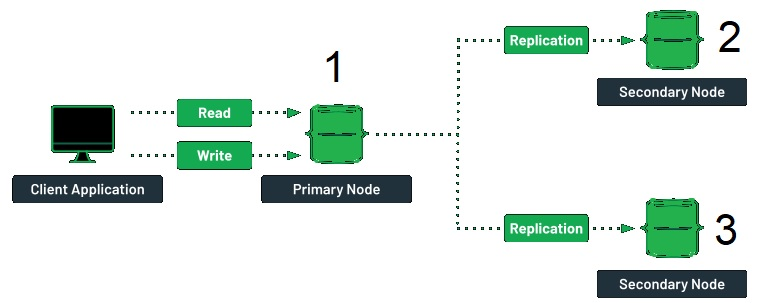
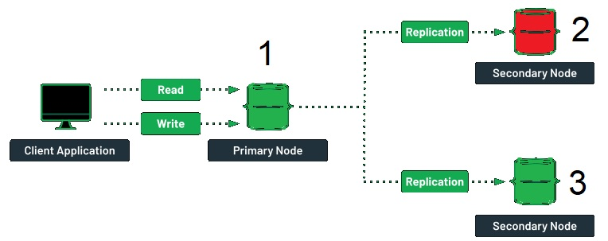
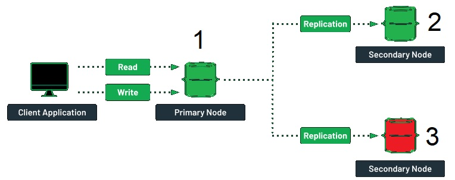
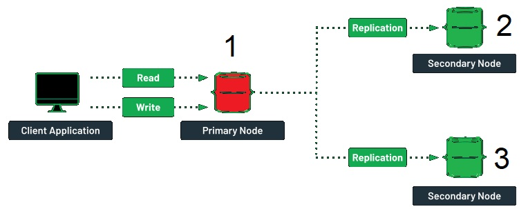

# Railway Ticket Booking System

Прототип распределенной системы для продажи железнодорожных билетов для одной из наиболее развитых железнодорожных сетей мира. Система обеспечивает устойчивость к обрывам связи при стабильной гарантированной производительности.

## Содержание

- [Команда](#команда)
- [Обзор](#обзор)
- [Сущности](#сущности)
- [Сценарии](#сценарии)
- [Реализация](#реализация)
- [Тестирование](#тестирование)
- [Поведение системы при отключении узлов](#поведение-системы-при-отключении-узлов)

## Команда

Состав:
- Mikhail
- Nshtk

## Обзор

Основная задача данной системы - упростить процесс бронирования железнодорожных билетов, позволяя пользователям осуществлять поиск доступных поездов, выбирать маршруты, места и производить оплату. Для достижения этой цели мы используем различные технологии и модели данных для эффективного хранения и управления данными.

## Сущности

Система имеет дело со следующими основными сущностями:

- **Остановочный пункт / Станция (Station)**: справочник станций, которые могут быть пунктом отправления или назначения в билете (Москва, Бологое, Санкт-Петербург).
- **Маршрут (Route)**: множество станций, на которых останавливается поезд (например, маршрут № 251: Москва, Тверь, Вышний Волочек, Бологое, Санкт-Петербург).
- **Поезд (Train)**: поезд, назначенный на указанные маршрут на конкретную дату (рейс поезда следует, назначенный на 25.09.2017  следует по маршруту #251).
- **Билет (TicketPlace)**: представляет собой место в поезде, которое может быть как свободным, так и купленным.

## Сценарии

Система поддерживает следующие пользовательские сценарии:

1. **Инициализация поездов**
    - Заполнение данными Station, Route
    - Заполнение данными Train и TicketPlace (порядка миллионов документов в TicketPlace)
2. **Поиск свободных мест и покупка билета**
    - Пользователь вводит станции отправления и назначения, дату отправления
    - Система определяет подходящие по станциям маршруты и ищет поезда, следующие по этим маршрутам, отображая только те, на которых есть свободные места
    - Пользователь выбирает поезд, система отображает свободные места
    - Пользователь выбирает свободное место и нажимает "Купить билет"
    - Система блокирует указанное место до символической "велиоплаты"
    - Пользователь оплачивает билет
    - Система помечает билет как купленные и снимает блокировку

## Реализация

Система состоит из нескольких компонентов:

- Сервисный класс для управления данными о станциях и маршрутах.
- Сервисный класс для управления данными о поездах.
- Сервисный класс для покупки билетов (добавление TicketPlace, изменение статуса и обработка платежей).
- Расширение сервиса покупки билетов на блокировку и освобождение мест в Hazelcast.
- Расширение сервисов для работы со справочными данными для добавления кэширования Hazelcast.
- Преобразование данных о билетах в формат, пригодный для индексирования в ElasticSearch.
- Сервисный класс для поиска поездов и билетов в ElasticSearch.
- Веб-страницы для поиска и отображения списков поездов и билетов.
- Веб-страницы для бронирования и покупки билетов.

## Тестирование

Этап тестирования включает в себя следующие шаги:

1. Подготовка и загрузка данных.
2. Функциональное тестирование загруженных данных и исправление ошибок.
3. Тестирование поведения системы при отключении узла.

## Поведение системы при отключении узлов
### Отказоустойчивость кластера Elastic:
В кластере может присутствовать как одна node, так и несколько. Node'ы в основном подразделяются на data node'ы, обеспечивающие возможность CRUD операций и master контролирующие node'ы. При конфигурации Elastic кластера из 3-х master-eligible data node, кластер будет работать при потере любой одной из них (при условии балансировки client-запросов между всеми node'ами). При этом, если создание реплик на других node'ах для primary shard'а недоступно, health кластера будет желтым, если primary shard недоступен и нет replica shard'а, чтобы назначить его primary, health кластера будет красным. 
### Отказоустойчивость кластера Hazelcast:
В случае Hazelcast отказоустойчивость кластера из 3-х node зависит от backup partitions, хранящихся в RAM. В случае потери одной из node, backup partition будут назначены primary, что обеспечит работоспособность кластера.
### Отказоустойчивость кластера MongoDB:

